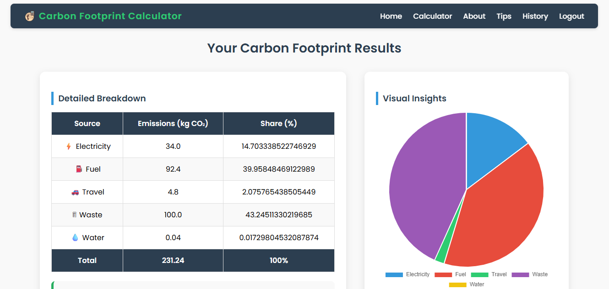

#  Carbon Footprint Calculator

The **Carbon Footprint Calculator** is a web-based application that helps individuals measure, track, and reduce their personal CO₂ emissions.  
It provides instant calculations, detailed insights, visual charts, and eco-friendly suggestions to encourage sustainable living.  
  
<br>

##  Features  

The Carbon Footprint Calculator comes with the following key features:  

-  **User Authentication**  
  Secure login, registration, and profile management.  

-  **Carbon Footprint Calculator**  
  Calculates emissions from electricity, fuel, travel, waste, and water usage.  

-  **Interactive Dashboard**  
  Displays total calculations, averages, and recent trends with beautiful charts (powered by Chart.js).  

-  **History Tracking**  
  View all past calculations in a structured history table.  

-  **Result Insights**  
  Provides personal efficiency score, category-wise share, and real-world impact equivalence (trees, distance driven).  

-  **Eco Tips & Benchmarks**  
  Personalized suggestions and reference values for good, average, and high usage levels.  

-  **Edit Profile**  
  Update username, email, and password securely.  

 


<br>


##  Tech Stack

- **Frontend:** JSP (JavaServer Pages), HTML5, CSS3, Chart.js  
- **Backend:** Java (Servlets), JDBC  
- **Database:** MySQL  
- **Build Tool:** Maven  
- **Server:** Apache Tomcat  
- **Version Control:** Git & GitHub  
- **IDE:** IntelliJ IDEA

<br>


##  Project Setup & Installation Guide

Follow these steps to run the project locally:

### 1. Clone the Repository
```bash
git clone https://github.com/your-username/Carbon-Footprint-Calculator.git
cd Carbon-Footprint-Calculator
```
### 2. Configure Database
1. Install MySQL on your system.
2. Create a new database (example: carboncalc).
3. Import the database schema & tables from the sql/ folder (if provided).
```
CREATE DATABASE carboncalc;
USE carboncalc;
-- Run the .sql script provided
```
4. Update your database credentials inside DBUtil.java:
```
private static final String URL = "jdbc:mysql://localhost:3306/carboncalc";
private static final String USER = "root";
private static final String PASSWORD = "your_password";
```
### 3. Build the Project
1. This project uses Maven. To build:
```
mvn clean install
```
### 4. Deploy on Tomcat
1. Install Apache Tomcat 9+.
2. Copy the generated .war file from the target/ folder into the tomcat/webapps/ directory.
   OR
   If using IntelliJ/Eclipse, configure Tomcat Server and run directly.

### 5. Run the Project
1. Start Tomcat.
2. Open your browser and go to:
```
http://localhost:8080/Carbon-Footprint-Calculator
```
### 6. Default Pages
1. Home Page: /index.jsp
2. Login Page: /login.jsp
3. Register Page: /register.jsp
4. Profile/Dashboard Page: /profile.jsp
5. History Page: /history.jsp


<br>


##  Folder Structure

The project follows a standard Maven + JSP structure:

- `src/main/java/` → Java source files (Servlets, DB Utility)  
- `src/main/webapp/` → JSP pages, CSS, Images, WEB-INF  
- `src/test/java/` → Unit tests (if any)  
- `pom.xml` → Maven dependencies & build configuration  


<br>


## Screenshots

### Login Page


### Home Page


### Calculator


### Result


### Profile Page


<br>


## Author
**Sumeeth Sangat**

-  [Email](mailto:sumeethsangat@gmail.com)  
-  [GitHub](https://github.com/Sumeeth11)  
-  [LinkedIn](https://www.linkedin.com/in/sumeethsangat)

